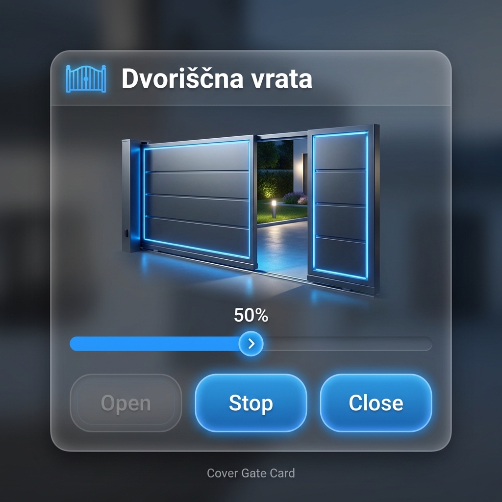
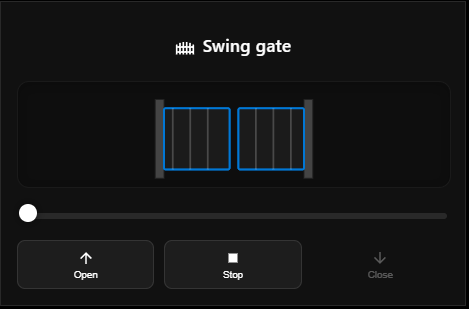
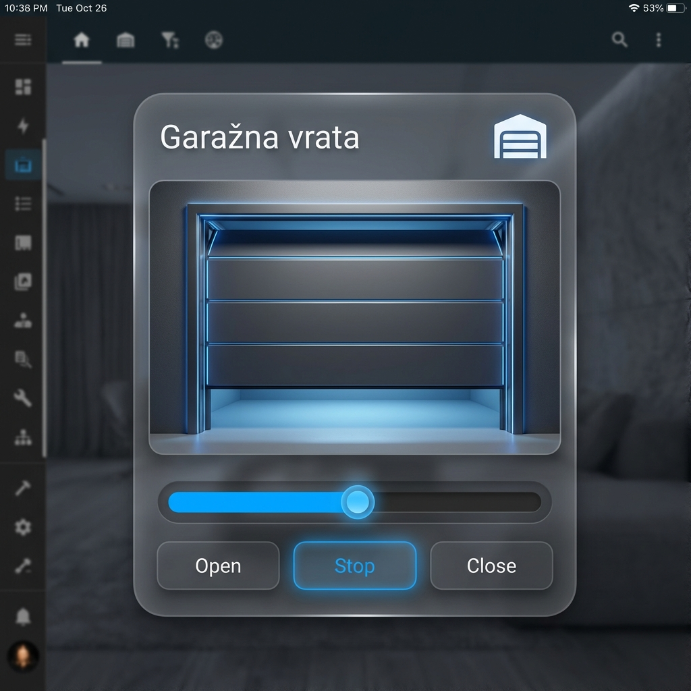

# Cover Gate Card
A modern Home Assistant custom card for controlling gates and garage doors with advanced animations.

## Features
- 🚪 **Multiple Gate Types**: Sliding Gate, Swing Gate, Garage Door
- ⏱️ **Time-Based Simulation**: Smooth simulated position for covers that don't report position
- 🎨 **Visualizations**: Animated SVGs for each gate type
- ⚙️ **Customizable**: Background opacity, stop button visibility, opening/closing times

## Screenshots

| Sliding Gate | Swing Gate | Garage Door |
|:---:|:---:|:---:|
|  |  |  |

## Installation

### HACS (Recommended)
1. Open HACS in Home Assistant.
2. Go to **Frontend**.
3. Click the menu button (top right) -> **Custom repositories**.
4. Add the URL of your repository:
   `https://github.com/MrSimpa/ha-cover-gate`
5. Select category **Lovelace**.
6. Click **Add**.
7. Find "Cover Gate Card" in the list and install it.
8. Restart Home Assistant (or reload resources).

### Manual Installation
1. Copy `cover-gate-card.js` to `/config/www/cover-gate-card.js`
2. Add to resources in Home Assistant:
```yaml
resources:
  - url: /local/cover-gate-card.js
    type: module
```

## Configuration

```yaml
type: custom:cover-gate-card
entity: cover.my_gate
gate_type: sliding        # sliding (default), swing, garage
opening_time: 20          # seconds (optional, for simulation)
closing_time: 20          # seconds (optional, for simulation)
background_opacity: 80    # 0-100 (optional, default 100)
show_stop_button: true    # boolean (optional, default true)
show_name: true           # boolean (optional, default true)
```

| Option | Type | Default | Description |
|--------|------|---------|-------------|
| `entity` | string | **required** | Cover entity ID |
| `name` | string | entity name | Custom display name |
| `show_name` | boolean | `true` | Show/Hide the card title |
| `gate_type` | string | `sliding` | `sliding`, `swing`, or `garage` |
| `opening_time` | number | `0` | Seconds to simulate opening (if position missing) |
| `closing_time` | number | `0` | Seconds to simulate closing |
| `background_opacity` | number | `100` | Card background opacity (0-100) |
| `show_stop_button` | boolean | `true` | Show/Hide the Stop button |


